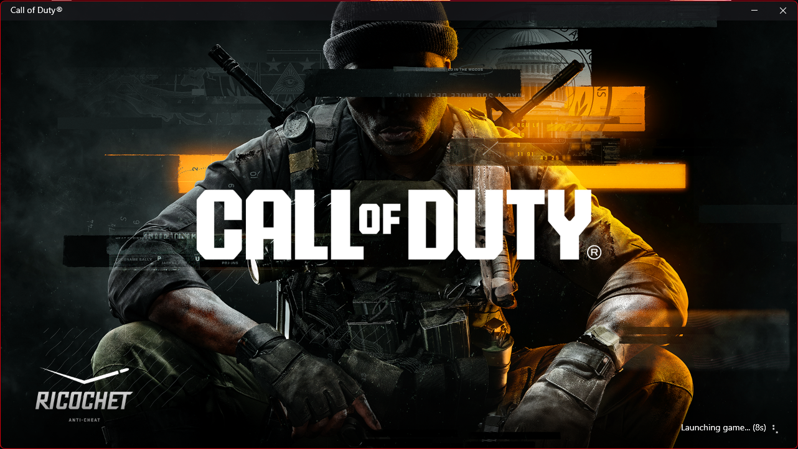

# REALLY WANT TO DO

- Implement a proper loading window a bit like COD BO6
- Window needs to be 1280 x 720
- It needs the game name at the top of the window
- It needs to have a picture as a background
- It needs a throbber and loading text
- It needs to open and terminate before anything else runs

- Implement ImGui
- Fix the debug UI

# Other things to fix
- Fix the syncing issue across all players and their weapons etc
